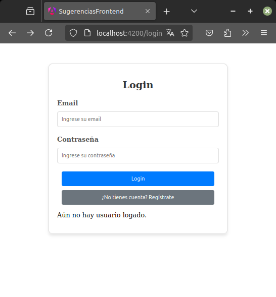
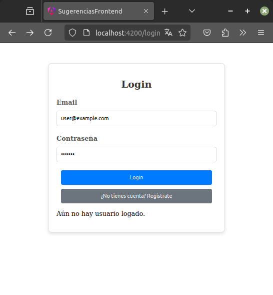
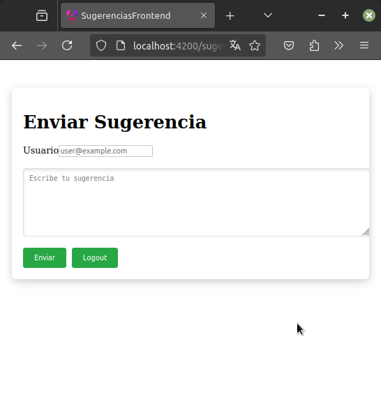
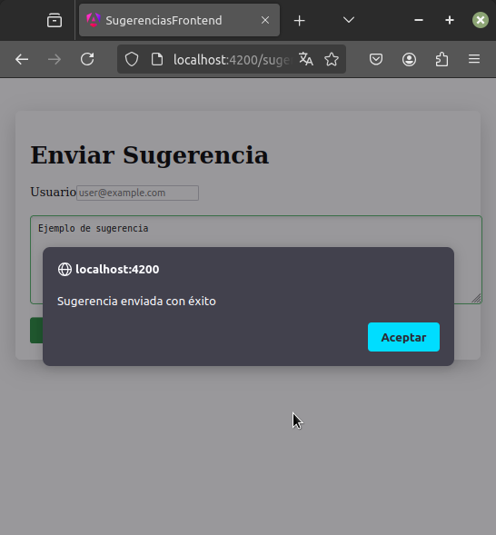
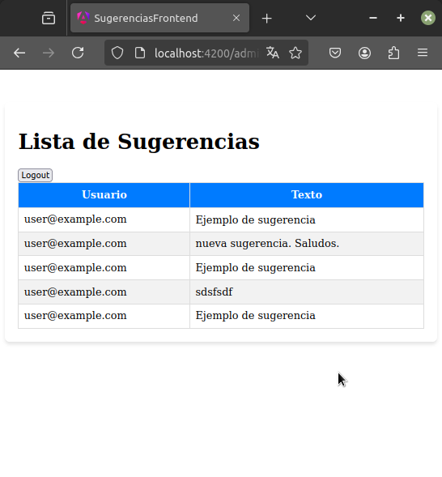
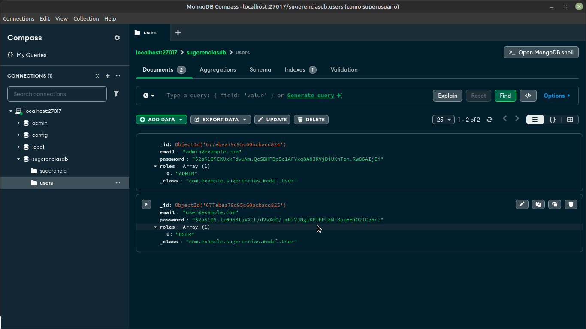
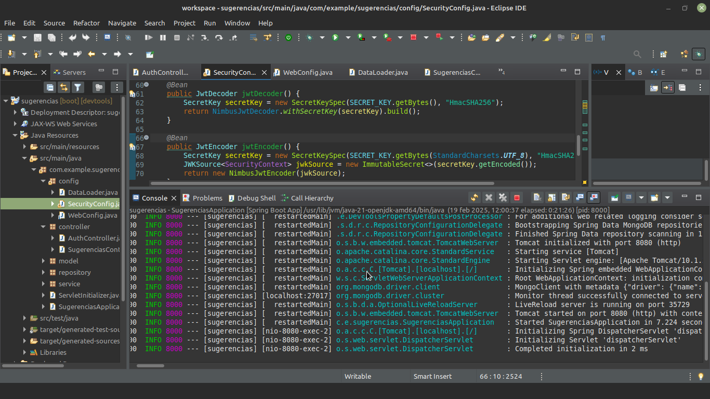
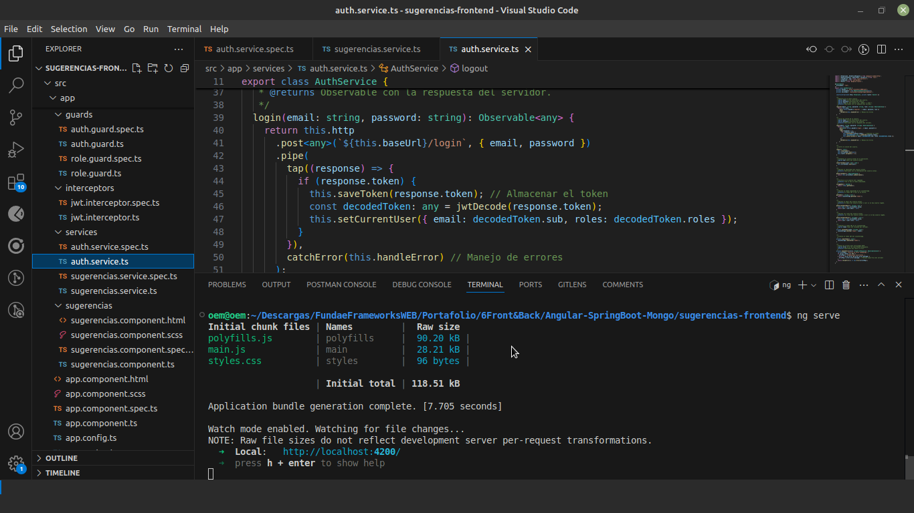

# 📩 Sistema de Envío de Sugerencias

Este proyecto es una aplicación web para el envío y gestión de sugerencias, diseñada con **Angular** en el frontend, **Spring Boot** en el backend y **MongoDB** como base de datos.

## 🚀 Tecnologías utilizadas

- **Frontend:** Angular 19 (Standalone Components)
- **Backend:** Spring Boot 3.x
- **Base de Datos:** MongoDB
- **Docker:** (Opcional) Para despliegue en contenedores

## 📜 Características

- Formulario de envío de sugerencias con validaciones.
- Listado de sugerencias enviadas.
- API REST para la gestión de sugerencias.
- Persistencia de datos en MongoDB.
- Interfaz amigable y responsiva.

## 📂 Estructura del Proyecto


```bash
ANGULAR-SPRINGBOOT-MONGO/
│── sugerencias-frontend/          # Aplicación Angular
│   ├── src/
│   ├── angular.json
│   ├── package.json
│   └── ...
│── sugerencias/           # Aplicación Spring Boot
│   ├── src/main/java/service/
│   ├── pom.xml
│   └── ...
│── docker-compose.yml # Configuración para despliegue con Docker
│── README.md          # Documentación del proyecto


🔧 Instalación y Ejecución
1️⃣ Clonar el repositorio

git clone https://github.com/lytsistemas/angular-springboot-mongo.git
cd sistema-sugerencias

2️⃣ Configurar y ejecutar el Backend (Spring Boot)

    Ir al directorio backend/
    Configurar MongoDB en application.properties
    Ejecutar el backend con:

mvn spring-boot:run

3️⃣ Configurar y ejecutar el Frontend (Angular)

    Ir al directorio frontend/
    Instalar dependencias:

npm install

    Ejecutar la aplicación:

ng serve

4️⃣ Acceder a la aplicación

    Frontend: http://localhost:4200
    API Backend: http://localhost:8080/api/sugerencias

🐳 Despliegue con Docker (Opcional)

Si deseas ejecutar el sistema con Docker, usa:

docker-compose up -d
```

📄 Licencia

Este proyecto está bajo la licencia MIT. Puedes utilizarlo y modificarlo libremente.

📸 Capturas de pantalla

Ejemplo de la interfaz del sistema: 




















